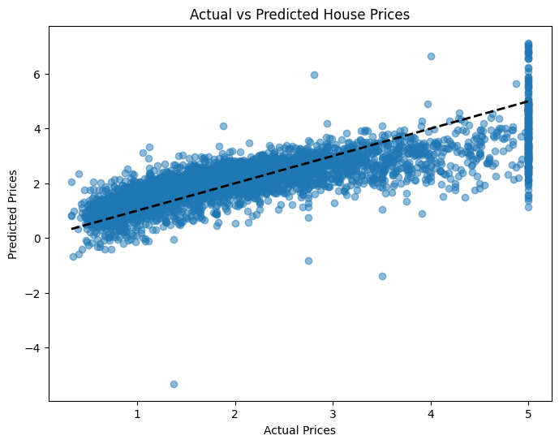
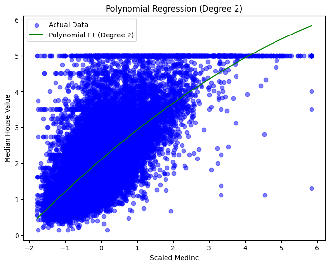

# Linear Regression on California Housing Dataset

## Overview
This project demonstrates the use of **Linear Regression** on the **California Housing dataset**. The goal is to predict **median house values** based on features such as median income, average rooms, population, etc.

The project includes both **theoretical explanations** and **practical implementation** in Python.

---

## Dataset
- **California Housing Dataset** from `sklearn.datasets`.
- Features include:
  - `MedInc`: Median income in block group
  - `HouseAge`: Median house age
  - `AveRooms`: Average rooms per household
  - `AveBedrms`: Average bedrooms per household
  - `Population`: Block group population
  - `AveOccup`: Average household occupancy
  - `Latitude` & `Longitude`: Geographic location
- Target:
  - `MedHouseVal`: Median house value for the block

---

## What You Will Learn
1. **Linear Regression Theory**
   - How the model fits a line to predict target values.
   - Concepts of **training error**, **test error**, and **RMSE**.
2. **Polynomial Regression (Optional Extension)**
   - How to extend linear regression to higher-degree features.
3. **Regularization Techniques**
   - Ridge Regression (L2) and Lasso Regression (L1) for reducing overfitting.
4. **Visualization**
   - Plotting predicted vs actual values.
   - RMSE curves for different polynomial degrees and regularization parameters.

---
# Linear Regression Results

### Multivariate Linear Regression (MLR)
The plot below shows predicted vs actual house values using **MLR**:



### Polynomial Linear Regression (PLR)
The plot below shows predicted vs actual house values using **PLR** (degree 2):



## How to Run
1. Clone the repository:
```bash
git clone https://github.com/YourUsername/YourRepo.git
cd YourRepo

