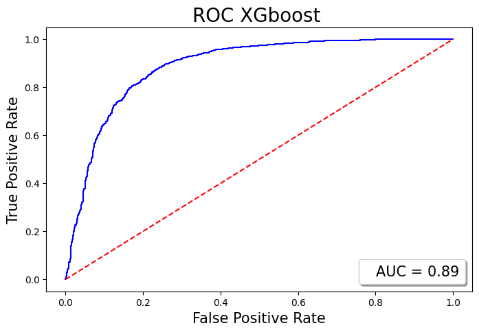

##  Project Overview

This project focuses on building a **Machine Learning Classification Model** to predict whether a client will subscribe to a term deposit after being contacted during a direct marketing campaign (phone calls) by a Portuguese banking institution.

The main goal is to help the bank **optimize its marketing strategy** by identifying the most influential customer and campaign attributes — minimizing costs and maximizing campaign success rate.

---

##  Key Objectives

- **Data Preparation:**  
  Clean, handle outliers, and preprocess the raw data, including extensive *One-Hot Encoding* and *Label Encoding* of categorical features (resulting in 48 processed columns).

- **Exploratory Data Analysis (EDA):**  
  Explore relationships between key features (e.g., `balance`, `campaign`, `previous`, `duration`) and the target variable (`deposit`).

- **Model Building:**  
  Implement and train a **Random Forest Classifier** to predict customer subscription behavior.

- **Feature Importance Analysis:**  
  Identify and interpret the most critical features influencing a positive deposit decision (notably `duration`, `age`, a
---
## Bank Marketing Campaign Recommendations

Based on the analysis, the bank can optimize future marketing campaigns:

1. **Target months** with higher subscription rates: March, September, October, December.  
2. **Focus on seasons:** Fall and Winter for higher subscription likelihood.  
3. **Limit campaign calls:** No more than 3 calls per client to improve efficiency.  
4. **Target age groups:** Younger clients (20s or below) and older clients (60+), who show higher subscription probability.  
5. **Occupation focus:** Retired and student clients are more likely to subscribe.  
6. **Balance and loans:** Target clients with average or high balances; avoid those with house loans in low-balance category.  
7. **Engage during calls:** Use engaging questionnaires to increase call duration, positively impacting subscription probability.  
8. **High duration calls:** Prioritize clients with above-average call duration (>375 seconds) for higher conversion likelihood.  

By applying these strategies, future campaigns should become more efficient and successful.

---
## Results

---
## References
- [Bank Marketing Campaign Opening a Term Deposit (Kaggle)](https://www.kaggle.com/code/janiobachmann/bank-marketing-campaign-opening-a-term-deposit#ROC-Curve-(Receiver-Operating-Characteristic))  
- [Bank Marketing Analysis (Kaggle)](https://www.kaggle.com/code/aleksandradeis/bank-marketing-analysis/notebook#Data-Cleaning)  
- *Hands-On Machine Learning with Scikit-Learn and TensorFlow* by Aurélien Géron

