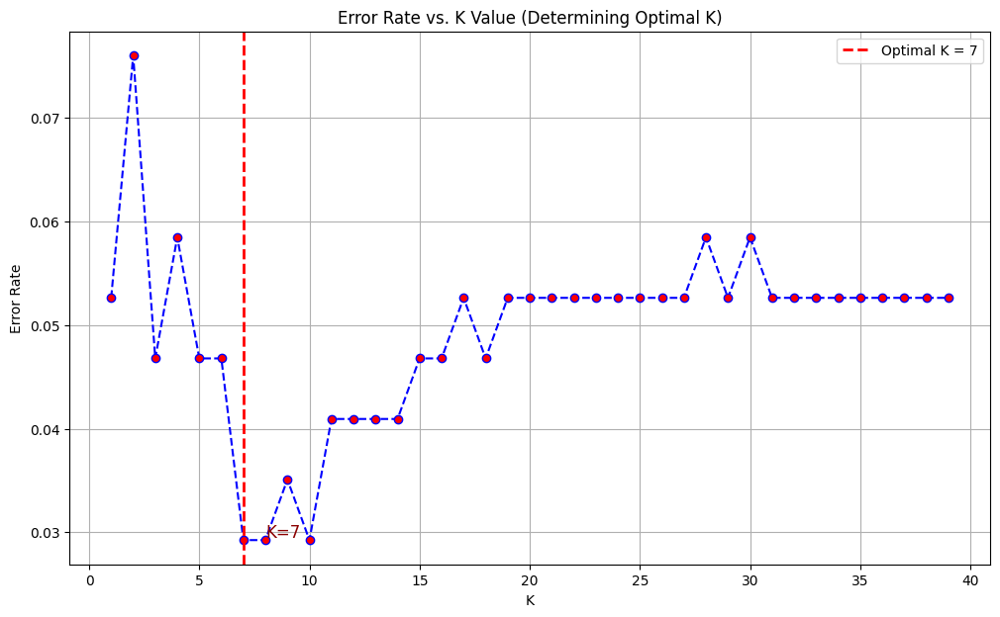

## Project Description

This project implements a robust and optimized k-Nearest Neighbors (kNN) classification model to accurately predict whether a tumor is **Malignant (Cancerous)** or **Benign (Non-Cancerous)**. The methodology focuses on overcoming the key challenge inherent to distance-based algorithms: **feature scale disparity** due to unscaled data.

The model was built using the **Wisconsin Diagnostic Breast Cancer (WDBC)** dataset. The entire pipeline, from Exploratory Data Analysis (EDA) to final model evaluation, is optimized for stability and high performance, achieving an overall accuracy of **95.32%**.

---

##  Key Features and Methodology

### 1. Data Analysis (EDA) & Preprocessing

* **Scale Disparity Handling:** Box Plots confirmed significant differences in feature scales (e.g., `area` vs. `fractal dimension`), necessitating immediate scaling.
* **Outlier Robustness:** The **RobustScaler** was selected and used to transform the data. This scaler is resistant to the numerous outliers identified, ensuring a stable distance calculation for kNN.
* **Dimensionality:** The model was trained using all **30 original features** after robust scaling, leveraging their combined predictive power.

### 2. Hyperparameter Optimization

* **Optimal K Determination:** The optimal number of neighbors (**$K$**) was determined using **GridSearchCV** combined with **5-Fold Cross-Validation** (CV).
* **Optimization Goal:** The search was focused on the training set to prevent data leakage, optimizing the model for the best **F1-Score** or **Recall**, which are critical metrics in medical diagnosis.

### 3. Final Model Evaluation

The final model's performance was rigorously assessed on a completely unseen test set.

* **Visual Analysis:** Plotting the **Error Rate vs. $K$ Value** curve to visually confirm the $\text{optimal } K$.
* **Error Visualization:** Generating a **Confusion Matrix Heatmap** to visualize the balance between True Positives/Negatives and the critical **False Negative (Type II)** errors.

---

##  Final Performance Results

The final model was evaluated on the test set, yielding the following results:

| Metric | Class: Malignant (0) | Class: Benign (1) |
| :----- | :------------------: | :---------------: |
| **Precision** | $0.9667$ | $0.9459$ |
| **Recall (Sensitivity)** | $0.9062$ | $0.9813$ |
| **F1-Score** | $0.9355$ | $0.9633$ |
| **Support** | 64 | 107 |
| **Overall Accuracy** | **0.9532** | |

**Key Interpretation:**

* **High Precision (Malignant):** When the model predicts cancer, it is correct **96.67%** of the time.
* **High Recall (Benign):** The model is excellent at correctly identifying non-cancerous cases (**98.13%**).
* **Area for Improvement (Malignant Recall):** The Recall for the Malignant class is **90.62%**. This indicates that approximately **9.38%** of actual cancer cases (False Negatives) were missed by the model—the primary area for future model improvement.

---
## finding optimal value of k for knn

