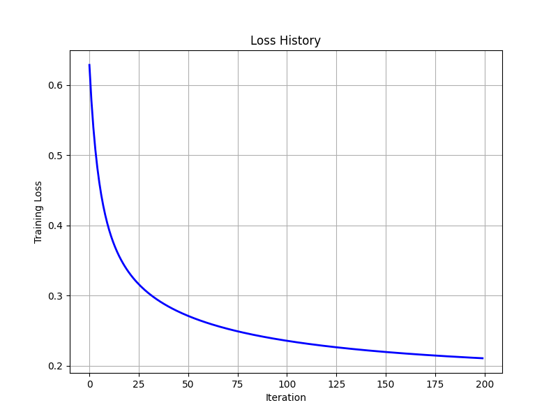
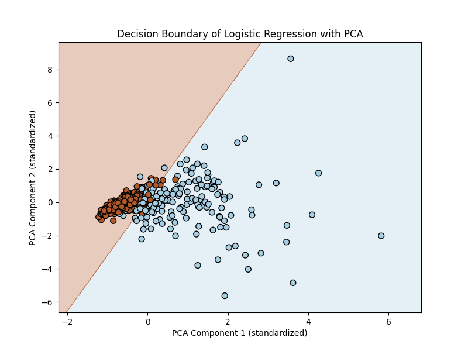

# Logistic Regression

This repository provides a **theoretical and practical walkthrough** of Logistic Regression.  
It connects mathematical foundations to real-world applications with visualizations and datasets.

---

## Overview

Logistic Regression is a **supervised learning algorithm** used for classification tasks.  
It predicts probabilities using the **sigmoid function** and maps them into binary or multiclass outcomes.

---

## Key Concepts

### Sigmoid Function
The sigmoid maps linear values into probabilities:
  
$$
\sigma(z) = \frac{1}{1 + e^{-z}}
$$

### Decision Rule
- If probability ≥ threshold → class = 1  
- If probability < threshold → class = 0  
(Default threshold = 0.5)

### Loss Function (Binary Cross-Entropy)

$$
L = -\frac{1}{N} \sum_{i=1}^N \Big[ y_i \log(p_i) + (1-y_i)\log(1-p_i) \Big]
$$
---

##  Dataset & Preprocessing

- **Breast Cancer dataset** (binary classification)  
- Dimensionality reduction with **PCA (2 components)** for visualization  
- Standardization applied before training

---

## 🔍 Implementation Outline

1. Data loading and preprocessing  
2. Logistic Regression training (binary and multiclass)  
3. Visualization of:
   - Loss History
   - Decision Boundaries  
4. Model evaluation

---

## Visualizations

### Loss History
Training loss decreases over iterations, showing convergence of Gradient Descent.



### Decision Boundary
Clear separation of classes in 2D PCA space.



---

## Repository Structure
```
├── Logistic_Regression.ipynb # Main Jupyter Notebook
├── images/
│ ├── loss_history.png
│ └── decision_boundary.png
└── README.md
```
